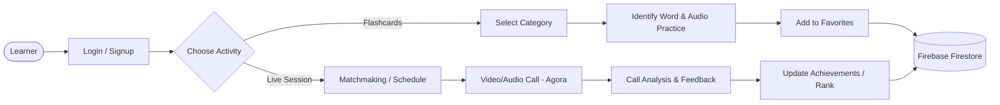
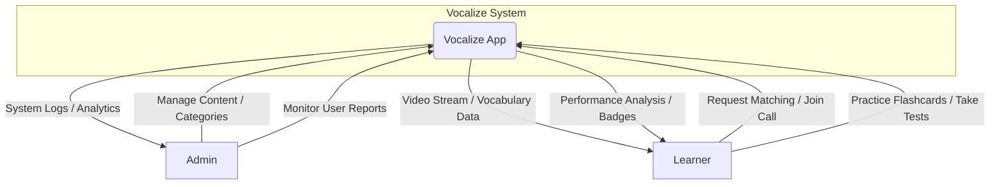
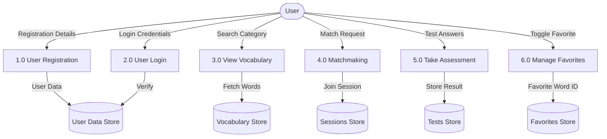
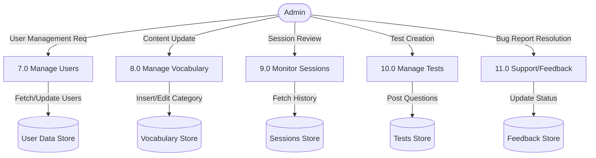
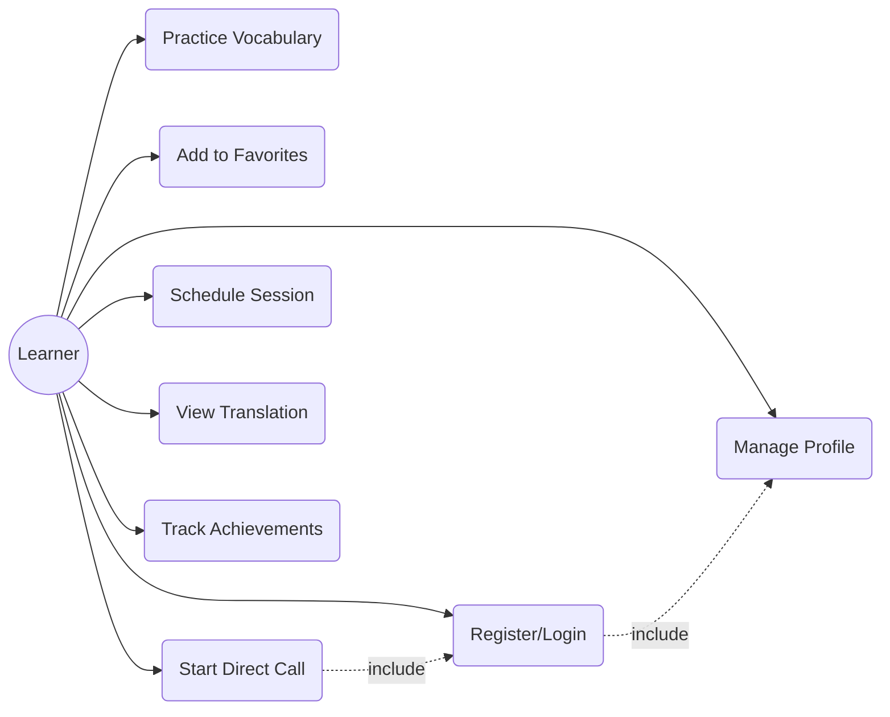
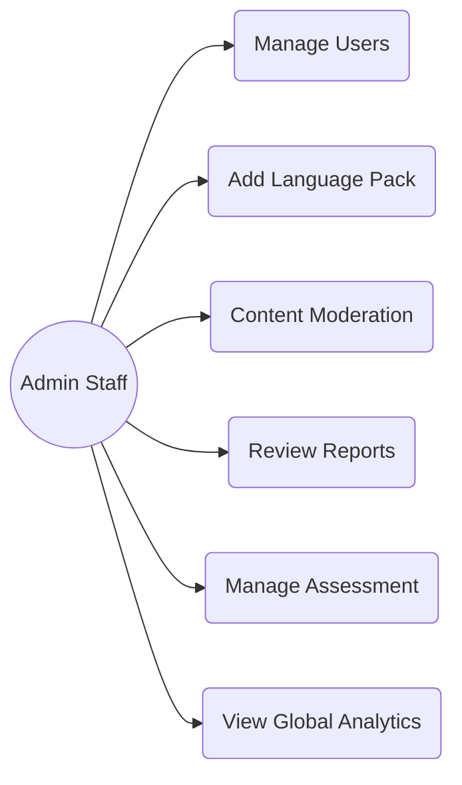
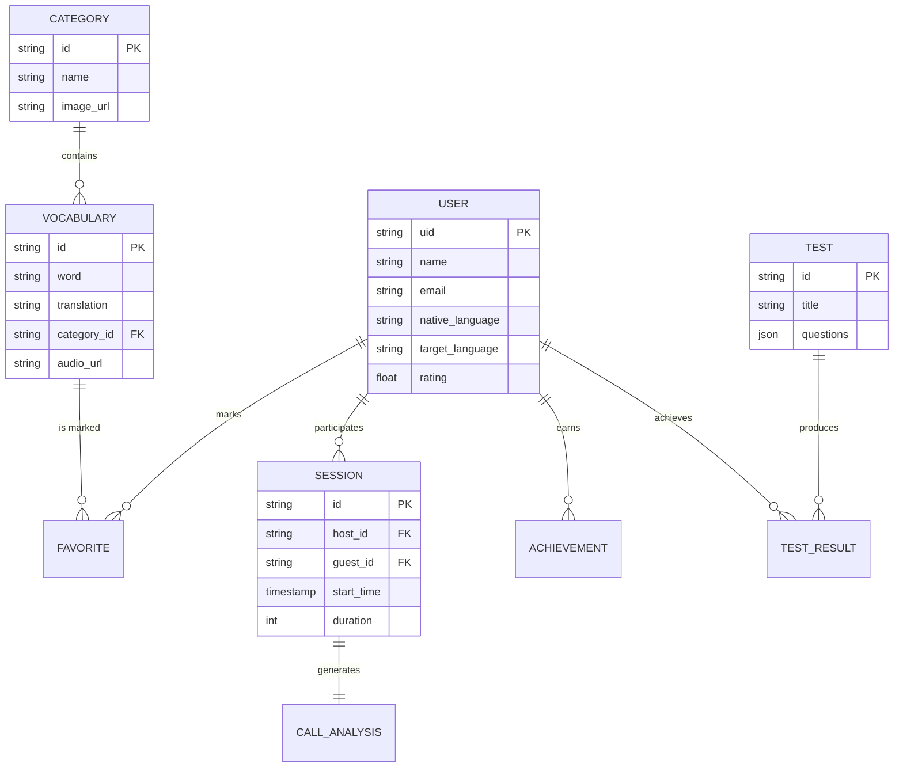

# Vocalize Project Diagrams

These diagrams replicate the logical structure and flow of the [Major PPT examples](file:///Users/yashitaliya/StudioProjects/vocalize/Major%20PPT.pdf), accurately mapped to the **Vocalize** language learning application entities.

---

## 1. Workflow Diagram
The high-level user journey from onboarding to real-time communication and progress tracking.

---

## 2. Context Level DFD
Defines the external entities and their interactions with the Vocalize System.

---

## 3. 1st Level DFD (User Side)
Detailed processes mapping user interactions with data stores.

---

## 4. 1st Level DFD (Admin Side)
Backend processes for administrative control.

---

## 5. Use Case Diagrams
Visualizing functional requirements for each actor.

### User (Learner) Use Case

### Admin Use Case

---

## 6. Database Design (ER Diagram)
Entity relationship mapping for Vocalize's Firestore structure.

